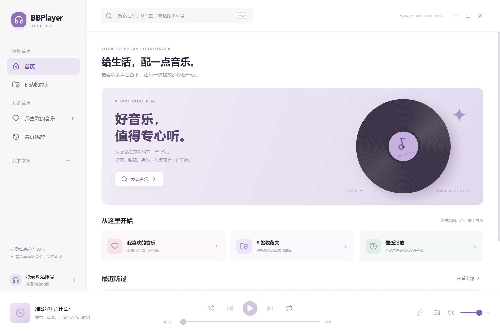
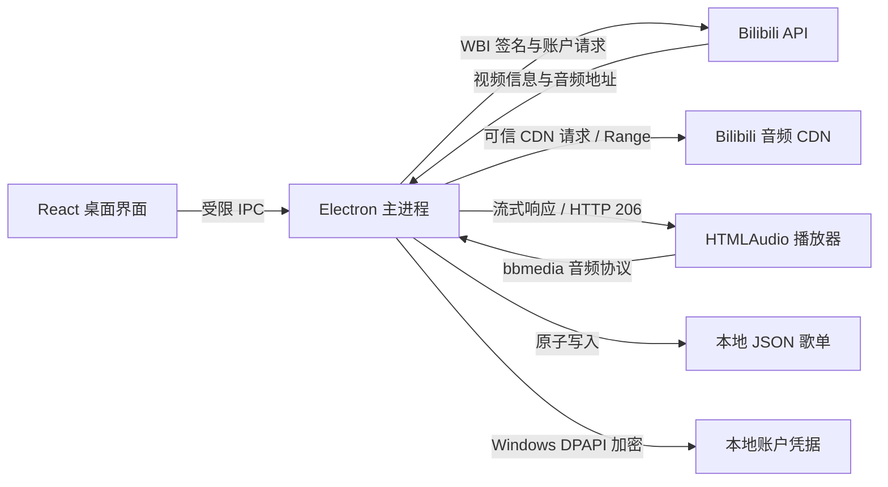

# BBPlayerForWin

基于 [BBPlayer](https://github.com/bbplayer-app/BBPlayer) 开发的 Windows 桌面 Bilibili 音频播放器。使用 React + Electron，让搜索、收藏夹和本地歌单在电脑上播放。

当前源码版本为 **0.1.4**，提供自动备份与恢复、旧版数据迁移、更新缓存管理，并包含版本校验更新、播放恢复、托盘和使用状态恢复。本仓库保留上游 monorepo，桌面应用位于 [`apps/desktop`](./apps/desktop)，采用独立依赖。项目为社区移植，与 Bilibili 官方无关联。



## 功能与当前范围

| 功能 | 当前支持情况 |
| --- | --- |
| 搜索 | 歌名、UP 主关键词、BV 号、完整 B 站视频链接，支持分页 |
| 播放 | AAC 音频、播放/暂停、进度拖动、音量、上一首/下一首 |
| 播放队列 | 队列查看、随机播放、单曲循环、列表循环、顺序播放 |
| 多分 P 视频 | 在播放队列弹窗中选择当前视频的分 P |
| 登录与收藏夹 | B 站 App 扫码登录、退出登录、读取账号创建的收藏夹 |
| 本地音乐库 | 新建/删除歌单、添加/移除歌曲、喜欢、最近播放、自动保存 |
| 歌词 | 手动粘贴 LRC 歌词并按播放时间高亮 |
| 备份 | JSON 导入、合并、导出；自动备份最近 10 份，恢复前保留原数据，损坏时自动恢复；不包含登录凭据 |
| Windows 操作 | 窗口最小化/最大化、系统媒体按键、键盘快捷键 |
| 播放恢复 | 网络重连、音频错误或缓冲超时后刷新地址，保留分 P 与播放进度，最多重试 3 次 |
| 托盘 | 后台播放、显示窗口、播放/暂停、上一首/下一首、退出，可记住关闭方式 |
| 使用状态 | 恢复队列、当前歌曲与分 P、进度、随机模式、本地页面、窗口尺寸与位置；启动保持暂停 |
| 软件更新 | 检查正式 Release 版本；安装版下载后进行 SHA256 校验，由用户确认安装；便携版提供下载入口 |
| 分发 | Windows x64 安装包、便携版构建 |

首版尚未移植离线下载、音频文件导出、自动歌词匹配、桌面悬浮歌词、网易云/QQ 歌单导入和 Android 主题装扮。暂不支持 b23.tv 短链接、AV 号输入及 macOS/Linux 分发。

## 使用方法

### Windows 用户

运行环境为 **Windows 10/11 x64**。在 [GitHub Releases](https://github.com/IblankD/BBPlayerForWin/releases/latest) 下载安装版或便携版，也可按下文从源码构建。Release 中的 `SHA256SUMS.txt` 提供文件校验值。

以下为当前源码的构建输出，位于 `apps/desktop/release/`；GitHub 已发布版本以 Release 标签为准：

- `BBPlayer-0.1.4-x64-Portable.exe`：便携版，双击运行，无需安装。
- `BBPlayer-0.1.4-x64-Setup.exe`：安装版，可选择安装目录并创建桌面快捷方式。

当前产物尚未代码签名。

### 已安装用户升级

`0.1.1/0.1.2` 不包含更新入口，需要先下载 `0.1.4` 安装包并手动覆盖安装一次。选择原安装目录，无需先卸载，本地歌单和使用状态保存在独立用户数据目录。

从 `0.1.3` 起，程序启动 10 秒后检查正式发布版本，运行期间每 6 小时检查一次；也可点击左下角“检查更新”。安装版发现新版后，可点击“下载并校验更新”，等待 SHA256 校验通过，再点击“退出并安装更新”。程序保存状态后打开安装向导，由用户完成安装；不会静默安装。

便携版请从发布页下载，退出后替换原 `.exe`。若 GitHub API 限流，程序会通过官方最新发布页检查版本，并提供下载入口；没有校验信息时不执行应用内安装。下载需要能够访问 GitHub，使用系统网络代理配置。

### 开始听歌

1. 在顶部搜索框输入歌名、UP 主、BV 号或完整视频链接，按 Enter 搜索。
2. 点击结果左侧播放按钮或歌曲标题。底部播放器支持暂停、拖动进度和音量调整。
3. 点击爱心加入“我喜欢的音乐”；点击加号将歌曲加入歌单。侧栏“我的歌单”旁的加号用于新建歌单。
4. 点击左下角“登录 B 站账号”，使用哔哩哔哩 App 扫码，并在手机上确认。登录后进入“B 站收藏夹”。
5. 点击底部歌词图标，粘贴带时间标签的 LRC 文本并保存。首版需要手动提供歌词。
6. 点击“歌单备份与设置”，导出 JSON 备份，或导入已有备份并合并歌单。下方可立即备份或选择自动备份恢复，恢复会替换歌单、历史、歌词和播放设置，并保留一份恢复前的数据。
7. 关闭窗口时选择后台播放或退出，也可记住选择；在设置中可改为每次询问。双击托盘图标显示窗口，右键菜单可控制播放并退出。
8. 重新打开程序后，点击底部播放按钮，从上次位置继续。启动时保持暂停，不会突然播放声音。

示例 LRC：

```text
[00:00.00]第一行歌词
[00:05.50]第二行歌词
```

| 快捷键 | 操作 |
| --- | --- |
| 空格 | 播放 / 暂停；输入文字或打开弹窗时不触发 |
| Ctrl + → | 下一首 |
| Ctrl + ← | 上一首；当前播放超过 3 秒时先回到曲首 |
| 键盘媒体键 | 播放/暂停、上一首、下一首 |

程序启动时及歌单变化时自动备份（变化间隔至少 5 分钟），保留最近 10 份。旧版数据会迁移到带版本号的格式；遇到无法识别的版本则停止启动并保留原文件。更新页显示缓存大小并支持清理，启动时自动删除上次遗留的安装包。备份只含音乐库，队列、窗口与账号不进入备份。

本地歌单和歌词会自动保存。此处的“本地歌单”保存视频引用和元数据，播放 B 站音频仍需要联网；未登录也可以搜索、播放允许匿名访问的公开视频。

## 从源码运行与构建

### 环境

- Windows 10/11 x64
- Node.js 24 LTS；当前验收版本为 24.12.0
- pnpm 11.21.0，与桌面应用的 `packageManager` 配置一致
- Git

以下命令在克隆后的仓库根目录执行。只开发桌面版时，安装 `apps/desktop` 的依赖即可，无需 Android SDK、Java、Expo 或根目录移动端依赖。

```powershell
git clone https://github.com/IblankD/BBPlayerForWin.git
cd BBPlayerForWin
pnpm --dir apps/desktop install --frozen-lockfile
pnpm --dir apps/desktop dev
```

启动已构建的本地应用：

```powershell
pnpm --dir apps/desktop build
pnpm --dir apps/desktop start
```

生成 Windows 安装包和便携程序：

```powershell
pnpm --dir apps/desktop dist:win
```

仅生成解包后的应用目录：

```powershell
pnpm --dir apps/desktop pack
# 运行 apps/desktop/release/win-unpacked/BBPlayer.exe
```

首次安装会下载 Electron，首次打包还会下载 NSIS 等构建工具，需要网络连接。若下载受网络环境影响，可以使用经过信任的镜像配置；不要关闭证书校验。

### 开发检查

```powershell
pnpm --dir apps/desktop type-check
pnpm --dir apps/desktop lint
pnpm --dir apps/desktop test
pnpm --dir apps/desktop build
pnpm --dir apps/desktop smoke
# 完成 dist:win 后验收便携启动器
pnpm --dir apps/desktop smoke:portable
# 完成 dist:win 后验收版本检查和更新流程（不执行实际安装）
pnpm --dir apps/desktop smoke:update
```

`smoke` 会启动真实 Electron，使用独立临时数据目录，访问 B 站公开 MV，验证播放、拖动进度、歌单保存、歌词、备份及重启恢复，因此需要联网。便携启动器使用单独的验收脚本，详情见 [验收记录](./apps/desktop/VERIFICATION.md)。

根目录的 `pnpm type-check` / `pnpm lint` 属于上游 monorepo 检查，需要另外安装上游根依赖。桌面版有独立 workspace 和锁文件，并从根 workspace 中排除，使用上述桌面命令检查。

## 基本架构与运行原理



### 界面与播放

渲染进程使用 React、TypeScript 和 Vite，负责桌面布局、搜索结果、歌单、歌词及播放控制。音频由 Chromium 的 `HTMLAudioElement` 播放，歌词根据当前播放时间高亮；Windows 媒体操作通过 Electron 全局媒体快捷键和浏览器 Media Session 接入。

### B 站接口与 WBI 签名

网络请求由 Electron 主进程完成。搜索及音频地址接口沿用原项目的 WBI 参数签名算法：获取密钥、按映射表混排、排序并清理请求参数，加入时间戳后计算 MD5 签名。主进程负责账户 Cookie 和必要请求头，预加载脚本只向界面暴露搜索、播放、登录和歌单等明确操作。

### 音频流转发

获取音频地址后，主进程生成临时 token，将 `bbmedia://audio/<token>` 交给播放器。自定义协议转发可信 B 站 CDN 的流式响应，同时转发 Range 请求和 Content-Range 等响应头，实现缓冲与进度拖动。

主进程优先使用满足域名和端口限制的 CDN 地址；如果首选地址不符合要求，会选择接口提供的可信备用地址。重定向同样检查域名与协议。音频 CDN 请求不携带账号 Cookie。

### 本地数据与隔离

- `library.json` 保存歌单、历史、手动歌词、音量和循环偏好，通过临时文件加重命名完成原子写入。
- `account.bin` 使用 Electron `safeStorage` 保存加密凭据，在 Windows 上由 DPAPI 保护。
- `session.json` 保存队列、当前歌曲与分 P、进度、随机模式、本地页面和关闭偏好，不保存临时音频地址或账户凭据。进度每 5 秒保存，正常退出前会请求界面保存最新状态；异常中断可能丢失最近几秒进度。JSON 歌单备份不包含使用状态。
- `window.json` 保存窗口位置、尺寸及最大化状态，恢复时检查是否仍在可用显示器范围内。
- 数据位于 Electron 的用户数据目录，通常在 `%APPDATA%` 下。移动程序文件不会同时移动这一目录，因此便携版无需安装，但数据并不与 `.exe` 同目录保存。
- 渲染进程开启 sandbox 和 context isolation，关闭 Node integration，通过窄 IPC 接口访问主进程。
- 界面资源使用 `bbapp://` 自定义协议，并应用内容安全策略。

托盘后台播放会保留渲染窗口与播放器，暂停和切歌仍通过受限 IPC 完成。选择退出或点击托盘“退出 BBPlayer”会结束播放。

播放控制集中在 `src/player.ts`，通过请求代次忽略旧歌曲的异步响应。出现音频错误或 12 秒无进度时，在 1、3、6 秒后依次刷新地址；恢复保留分 P 和进度。断网时等待联网，手动暂停会取消自动恢复。视频不可用或请求受限时停止重试，并允许手动重试或切歌。

更新由主进程 `electron/updater.mjs` 完成，仅检查本仓库正式 Release，按语义版本比较版本号。下载限定匹配版本的 Windows x64 安装包，检查文件大小与 GitHub 提供的 SHA256，安装前再次校验。渲染进程不能指定下载地址或执行路径，下载缓存位于用户数据目录 `updates/`。SHA256 检查下载完整性，产物仍未代码签名。

### 目录结构

```text
apps/desktop/
├─ electron/
│  ├─ main.mjs          # 窗口、IPC、数据保存、自定义协议
│  ├─ preload.cjs       # 渲染进程可使用的受限接口
│  ├─ api.mjs           # 搜索、登录、收藏夹、音频流
│  └─ core.mjs          # WBI 签名、数据校验、CDN 检查
├─ src/                 # React 界面、类型、LRC 解析与样式
├─ scripts/             # 开发启动与真实应用验收
├─ tests/               # 核心逻辑测试
├─ build/icon.ico       # Windows 图标
├─ pnpm-lock.yaml       # 桌面独立依赖锁文件
└─ release/             # 本地构建产物，不纳入 Git
```

仓库中 `apps/mobile`、`apps/backend` 和其他共享包来自上游，作为保留的项目源码。桌面首版运行不依赖 Android 原生播放引擎。

## 验证结果与限制

已在 Windows x64 上通过桌面类型检查、lint、28 项核心测试、打包后的主程序验收和便携程序真实启动验收。验收覆盖播放恢复、后台播放、托盘控制和使用状态恢复。更新流程另有真实 GitHub 版本检查，以及模拟新版安装包的下载、校验和安装请求验收，测试不执行实际安装。

登录二维码已真实获取并展示；扫码确认后的真实账号及私人收藏夹访问仍需要用户本人验收。安装包已生成，尚未执行安装向导。B 站接口限流、视频下架、权限和网络状态可能影响搜索或播放。

详细证据与范围见 [VERIFICATION.md](./apps/desktop/VERIFICATION.md)。

## 参考项目与致谢

- **原项目 [bbplayer-app/BBPlayer](https://github.com/bbplayer-app/BBPlayer)**：本项目从其 `dev` 分支移植，保留上游历史、源码和 MIT 版权声明。桌面开发起点为提交 [`1e1ae9f`](https://github.com/bbplayer-app/BBPlayer/commit/1e1ae9f)。
- **[原项目 README](./README.upstream.md)**：说明原移动端的功能和结构；其中移动端功能不代表桌面首版全部支持。
- **[原项目文档](https://bbplayer.roitium.com)**：移动端使用与歌词规范等参考资料。
- **[上游 WBI 实现](./apps/mobile/src/lib/api/bilibili/wbi.ts)** 与 **[上游 B 站接口](./apps/mobile/src/lib/api/bilibili/api.ts)**：桌面签名和接口适配的主要依据。
- **[Electron](https://www.electronjs.org/docs/latest/)**、**[React](https://react.dev/)**、**[Vite](https://vite.dev/)** 和 **[electron-builder](https://www.electron.build/)**：桌面运行时、界面、构建与 Windows 打包工具。

## 许可证

项目沿用 [MIT License](./LICENSE)，保留原作者 `Copyright (c) 2025 Roitium.`。复用或分发源码时应保留原许可证和版权声明。Bilibili 内容及第三方资源的权利归相应权利人所有。
